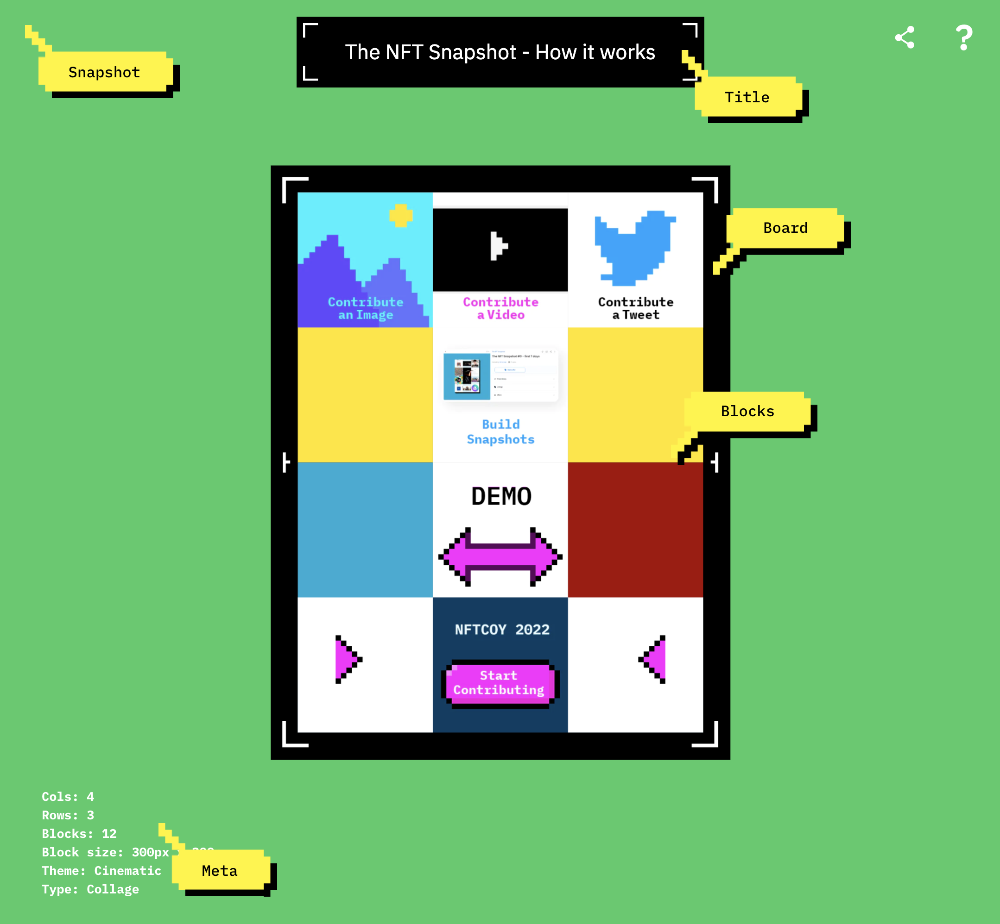

# Themes repository

This repository contains a collection of themes that can be used to create unique views for snapshots.

## What is a Theme?

A theme is a collection of styles and components that define the appearance of Snapshot. Each theme should export two components that wrap the snapshot's Title and Board and a theme object that contains the styles for the various components.

## How to create a new Theme

To get started, you can use the [Default](Default/index.tsx) theme included in this repository as a template. Simply create a new folder with the name of your new theme, and copy the files from the [Default](Default/index.tsx) theme that you want to use as a starting point.

Once you have created your new theme folder, you can customize the files to create a unique look and feel. You can change the color palette, typography, and other design elements to suit your preferences. When you're done, be sure to save your new theme folder and submit it to the repository as a PR.

Each theme in the index file should export two React components that wrap the Snapshot's Title and Board as well as a theme object that defines the styles for the various snapshot components:

```Typescript
// index.tsx

// Theme object
export const theme: Theme = {
  breakpoints: {
    mobile: "600px",
  },
  snapshot: {
    backgroundColor: "#490043",
    scale: 0.6
  },
  board: {
    backgroundColor: "transparent",
  },
  title: {
    color: "#000",
    backgroundColor: "#fff",
    fontSize: "2.5rem",
    padding: "1rem 4rem",
    fontWeight: "normal",
  },
  block: {
    fontSize: "5rem",
    backgroundColor: "transparent",
    color: "#fff500",
  },
  meta: {
    color: "#fff",
    fontSize: "1.5rem",
    fontWeight: "700",
  },
};

// Wrapper to create a Frame for SnapshotTitle
export const SnapshotTitleFrame = ({ children }: Props) => {
  return <div>{children}</div>;
};

// Wrapper to create a Frame for SnapshotBoard
export const SnapshotBoardFrame = ({ children }: Props) => {
  return <div>{children}</div>;
};

```

### Using Theme

To use a theme in the snapshot, reference the name of the theme in the snapshot's meta file. Theme object styles can be overridden by the snapshot meta `theme_styles` object.

```
...
"theme_styles": {
  "snapshot": {
    "backgroundColor": "red"
  },
  ...
},
"attributes": [
  {
    "trait_type": "Theme",
    "value": "ThemeName"
  },
  ...
```

### Snapshot Components schema


